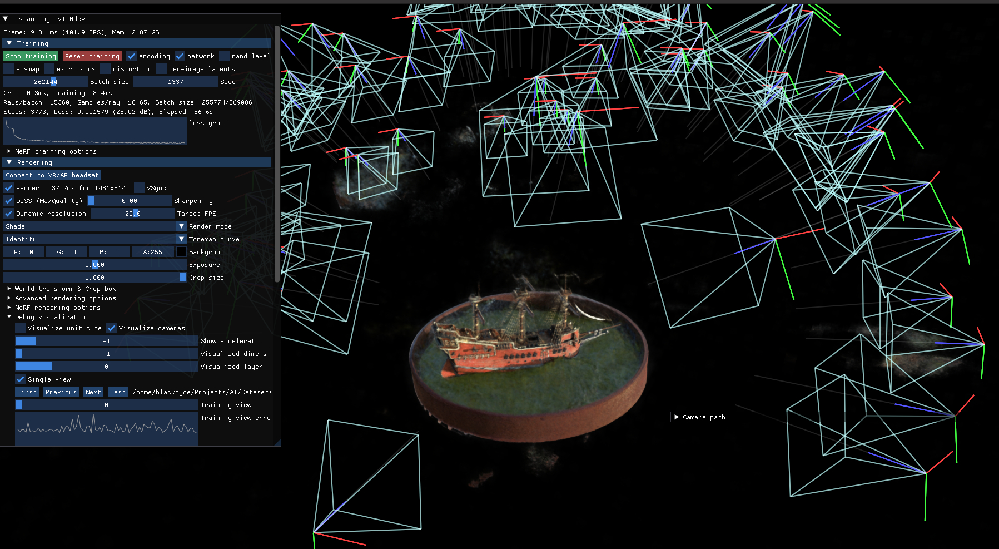

3D reconstruction

SfM positions + Instant-NGP (https://github.com/NVlabs/instant-ngp):  
   

Nerf lego:   

   

Usage:  
**./build/modules/sfm/eacham_sfm** *PATH_TO_CONFIG_FOLDER*

The result will be written to *'positions.json'*   

To use the result in Instant-NGP, one should to convert it using  
*./TransformToNerf* 'folder with dataset' 

**Dependencies:**
* GTSAM (optimization)
* OpenCV (Image reading, processing, feature extracting and matching)
* Eigen3 (Matrix operations)
* Pangolin (Visualization)
* nlohmann (JSON parser, included in thirdparty)
* LightGlue (ONNX, included in thirdparty)
* librealsense2 (optional)
* Conan 2.x.x (optinal)

**Further developmnent**
  * Code refactoring and computation time optimization
  * Instant NGP Runner
